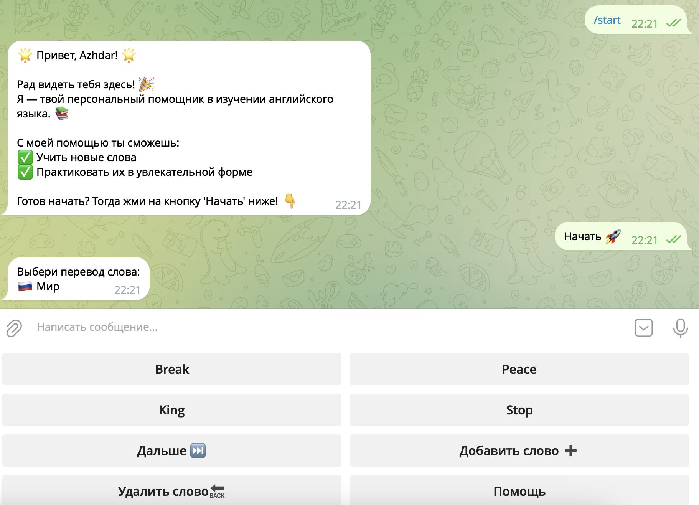

# Телеграм бот для изучения английского языка.

## Описание проекта
Этот бот для Telegram помогает пользователям учить английские слова в игровой форме. Он позволяет добавлять, удалять и просматривать слова, а также тестировать знания.
По умолчанию в боте уже находится 10 слов.

## Основные функции
- Добавление новых слов с переводом и вариантами ответов.
- Удаление слов из словаря.
- Тестирование знаний через карточки слов.
- Отправка сообщений с мотивацией и поддержкой.

## Используемые технологии
- Python
- telebot (PyTelegramBotAPI)
- Psycopg2 (через модуль `db`)
- configparser для работы с настройками

## Установка
1. Клонируйте репозиторий:
    ```bash
    git clone https://github.com/your-repo.git
    cd your-repo
    ```
2. Установите зависимости:
    ```bash
    pip install -r requirements.txt
    ```
3. Создайте файл `settings.ini` и укажите ваш токен Telegram API:
    ```ini
    [Telegram]
    token_tg=YOUR_BOT_TOKEN
    ```
4. Запустите бота:
    ```bash
    python bot.py
    ```

## Использование
- `/start` – Начать работу с ботом.
- `/cards` – Начать тестирование слов.
- Кнопки: "Добавить слово", "Удалить слово", "Дальше", "Помощь".
- Автоматическое определение правильного ответа и переход к следующему слову.

## Пример работы бота

Ниже приведен пример интерфейса бота:

